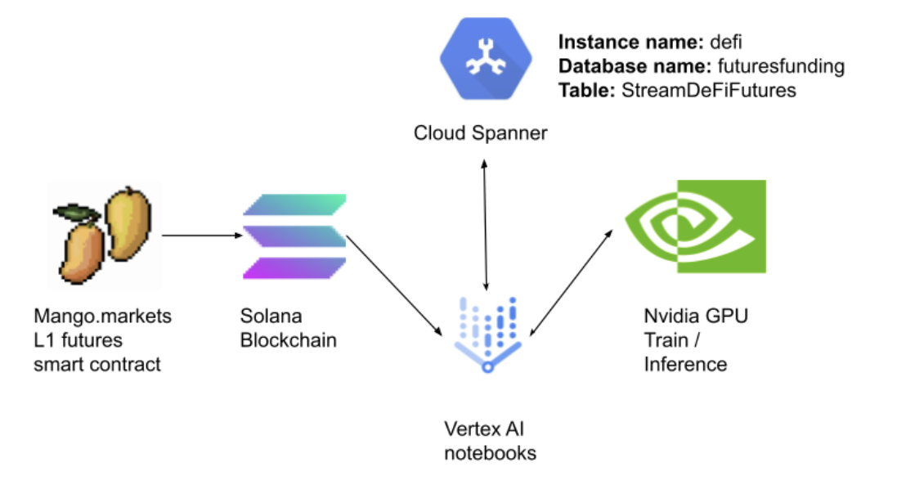

# Spanner DeFi connector and Timeseries GPU train/inference example

Google cloud platform real-time training/inference architecture




1) **Create Cloud Spanner instance called 'DeFi'. Open the Cloud shell or use the UI**
```shell
gcloud spanner instances create defi --config=regional-us-central1 \
    --description="Defi Futures stream" --nodes=1
```
- You could be prompted to enable Spanner APIs, this might take a minute.

2) **Create a new Vertex AI notebook with CUDA 11 GPU and Python 3+ support** [Optional] (code will work without GPU as well)
- Go to https://console.cloud.google.com/vertex-ai/workbench
- Click to enable notebooks API if you have not done so 
- Click on new notebook -> Python 3 (CUDA Toolkit 11.0) -> With 1 NVIDIA Tesla T4 [optional]
- Chose the region and check the "Install NVIDIA GPU Driver automatically for me"
- After the notebook has been created, click on 'Open Jupyterlab'
3) **Open a shell inside the notebook and clone the project -> navigate inside of the cloned project**
```shell
git clone https://github.com/galic1987/spanner-nvidia-vertex-inference-demo
cd spanner-nvidia-vertex-inference-demo

```

4) **Install the dependencies with pip from requriements.txt** Write the following line in notebook cell
```shell
!pip install -r requriements.txt
```

5) **Create a role and access key for spanner -> save it in the project and name it key.json**
- Go to https://console.cloud.google.com/iam-admin/serviceaccounts
- Click on create service account 
- Give it an arbitrary name
- Give it **Cloud Spanner Admin** Role
- Click Done
- Click on the new service account three dots and click 'Manage Keys'
- Click on add key -> Create new key -> JSON
- Create a new file **key.json** inside the Vertex notebook cloned project folder and paste the contents of downloaded key inside **key.json**

6) **Create a table 'StreamDeFiFutures'**

Run [1_create_database_and_table.ipynb](1_create_database_and_table.ipynb) notebook.

- If everything is ok the output should be 
``` 
Waiting for operation to complete...
Created database futuresfunding on instance defi
```
7) **Run the data stream ingestion job**

Open shell 
```shell 
conda create -n python39 python=3.9.2
conda activate python39
pip install -r requirements-connector.txt
python 2_connector_stream.py

```

- If everything is ok the output should be 
```
Inserted instance data.{'DATA_KEY': '83bfca51-7f81-43e1-9240-dad2df820d47', 'FUNDING': Decimal('-0.000017749'), 'OPEN_INTEREST': Decimal('370173.500000000'), 'ORACLE_PRICE': Decimal('40.735000000'), 'MID_PRICE': Decimal('40.735000000'), 'LONG_FUNDING': Decimal('148554.672244567'), 'SHORT_FUNDING': Decimal('148554.672244567'), 'APR': Decimal('-0.155484342'), 'APY': Decimal('-0.144000701'), 'SPREAD': Decimal('0.010000000'), 'SYMBOL': 'SOL-PERP', 'OBSERVATION_TIME': 'spanner.commit_timestamp()'}

```

8) **Wait until you see some data -> run the GPU traning / inference code**

Run [3_spanner_gpu_train_inference.ipynb](3_spanner_gpu_train_inference.ipynb) notebook.

9) **ML code is broken into following sections:**
- Spanner query data retrieval
- Data preprocessing 
- Time-series feature engineering 
- Target shift for variable time horizon 
- GPU Training and hyperparameter tuning 
- GPU Inference and visualization
- Feature importance 
- Model visualization 